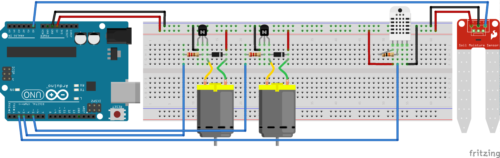

# regadeira 🌱

*Regadeira* é un sistema de rega automática para pequenos cultivos en invernadoiro. 

O sistema activa unha bomba de auga cando os valores proporcionados por un sensor de humidade en terra baixan dunha determinada porcentaxe. Tamén activa un ventilador cando os valores da temperatura ambiente sobrepasan un determinado límite.

## Montaxe

Ademais do microcontrolador escollido, neste caso un Arduino UNO v3, necesitaremos os seguintes materiais:

- Resistencias:
    - x2 de 220Ω para a bomba e o ventilador
    - x1 de 10kΩ para o sensor de temperatura
- [Transistor NPN] (x2)
- Diodo rectificador (x2)
- Mangueira e [bomba de auga]
- [Ventilador]
- Sensor de humidade en terra ([FC-28])
- Sensor de temperatura e humidade ambiente ([DHT11] ou [DHT22])

Esquema de montaxe:

> Sara Aguado Couselo (2022)

[bomba de auga]:https://www.luisllamas.es/bomba-de-agua-con-arduino/
[DHT11]:https://www.luisllamas.es/arduino-dht11-dht22/
[DHT22]:https://www.luisllamas.es/arduino-dht11-dht22/
[FC-28]:https://www.luisllamas.es/arduino-humedad-suelo-fc-28/
[Transistor NPN]:https://www.luisllamas.es/salidas-mayor-potencia-arduino-transistor-bjt/
[Ventilador]:https://www.luisllamas.es/controlar-un-ventilador-con-arduino/